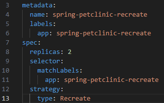
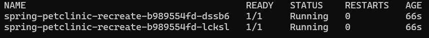
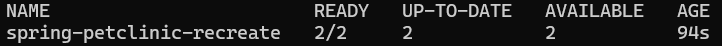
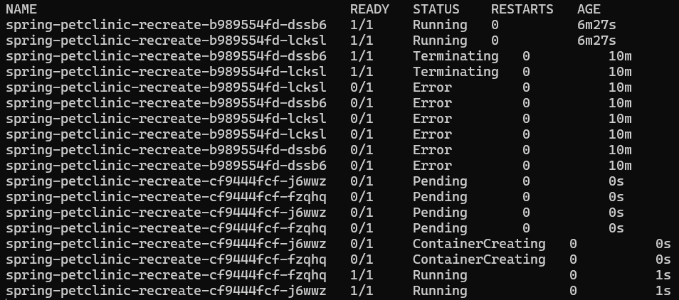
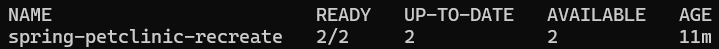
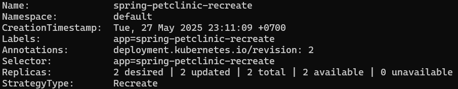
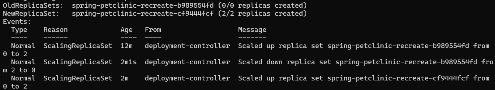

# Reflection 1
## 1.  Compare the application logs before and after you exposed it as a Service. Try to open the app several times while the proxy into the Service is running. What do you see in the logs? Does the number of logs increase each time you open the app?
- Before the app is exposed as a service, the application log only displays two messages. The first message shows that the HTTP server has started and is listening on port 8080. The second message shows that the UDP server has started and is listening on port 8081. After exposing the app as a service, we can interact and communicate with the server outside of Kubernetes cluster. When we open the site multiple times while the proxy is running, the log will expand. This is because the server constantly logs every HTTP request and the timestamp. Every time the app is opened, HTTP requests are sent to the server causing the log to record another message.

## 2. Notice that there are two versions of `kubectl get` invocation during this tutorial section. The first does not have any option, while the latter has `-n` option with value set to `kube-system`. What is the purpose of the `-n` option and why did the output not list the pods/services that you explicitly created?
- During this part of the tutorial, there are two versions of the kubectl get command. The first is used without any options, while the second uses the -n option with the value set to kube-system. The -n flag means namespace, so the command `kubectl get pods,services -n kube-system` retrieves all pods and services in the kube-system namespace. The previously created services and pods are in a different namespace (default), which is why the services/pods you created earlier do not appear in the output.

# Reflection 2
## 1. What is the difference between Rolling Update and Recreate deployment strategy?
- Rolling Update is a deployment strategy that updates pods gradually, one at a time or in small batches, while keeping the existing pods running. This ensures the application stays available during the update. It's similar to how red blood cells are replaced gradually by new ones from the bone marrow—continuous, seamless, and non-disruptive. This approach is ideal for critical applications like banking, trading, or healthcare apps where even a few seconds of downtime is unacceptable.

- Recreate, on the other hand, shuts down all existing pods before starting new ones with the updated version. This is like scrapping an old project and starting fresh. During this transition, the application experiences downtime. It’s more suitable for applications where brief downtime is acceptable, such as games or internal tools.

## 2. Try deploying the Spring Petclinic REST using Recreate deployment strategy and document your attempt.
a. Clean Up Previous Deployments
`kubectl delete deployment spring-petclinic-rest --ignore-not-found=true`
`kubectl delete service spring-petclinic-rest --ignore-not-found=true`

b. Make a new deployment file called recreate-deployment.yaml with the code just like the content of the file. The important part is to change the strategy to Recreate.

c. Run `kubectl apply -f recreate-deployment.yaml`.

d. Check the initial deployment status.
`kubectl get pods -l app=spring-petclinic-recreate -w` (run this in a separate window and keep it one)
`kubectl get deployment spring-petclinic-recreate`

e. Expose the deployment as a service
`kubectl expose deployment/spring-petclinic-recreate --type="LoadBalancer" --port=9966 --target-port=9966`
`minikube service spring-petclinic-recreate --url`

f. Trigger the update
`kubectl set image deployment/spring-petclinic-recreate spring-petclinic-rest-container=docker.io/springcommunity/spring-petclinic-rest:3.2.1`

g. Observe the Recreate strategy in action

h. Verify the update
`kubectl get deployments/spring-petclinic-recreate`
`kubectl describe deployment/spring-petclinic-recreate`

## 3. Prepare different manifest files for executing Recreate deployment strategy.
- I've implemented this in recreate-deployment.yaml

## 4. What do you think are the benefits of using Kubernetes manifest files? Recall your experience in deploying the app manually and compare it to your experience when deploying the same app by applying the manifest files (i.e., invoking `kubectl apply -f` command) to the cluster.
- Using Kubernetes manifest files significantly simplifies the deployment, update, and deletion process of an application. Unlike manual deployment, where I had to run multiple commands and risk introducing inconsistencies, manifest files allow me to declare the desired state of my application in code. Applying these files with `kubectl apply -f` makes deployments more consistent and repeatable across environments.

- While I’m currently using them manually, manifest files are a key enabler of continuous deployment (CD) practices. They can easily be integrated into automated pipelines, where updates to the code or configuration automatically trigger deployments. Even in my current workflow, I found them especially helpful under high-pressure conditions (just like mental fatigue and low sanity (Arknights reference)), as they reduce the chance of human error and simplify rollback or updates. Instead of relying on memory or command history, I can rely on version-controlled configurations to keep my deployments stable and predictable.

